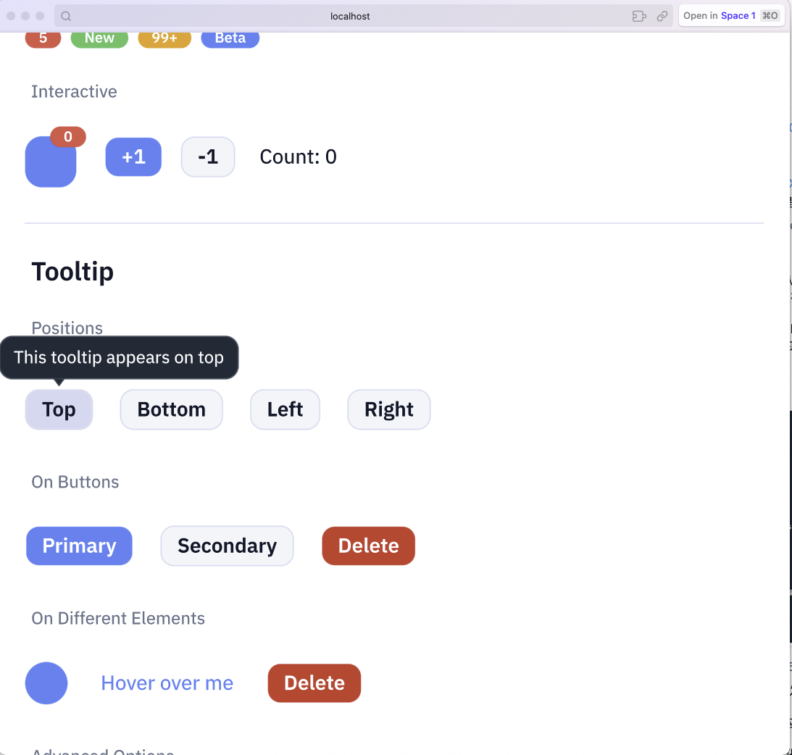

# Makepad Component

[](https://github.com/ZhangHanDong/makepad-component)
[](LICENSE)

**[中文](README_zh.md) | [日本語](README_ja.md)**

A modern UI component library for [Makepad](https://github.com/makepad/makepad), inspired by Longbridge's [gpui-component](https://github.com/longbridge/gpui-component).


## About Makepad

[Makepad](https://github.com/makepad/makepad) is a next-generation UI framework written in Rust, featuring:

- **GPU-accelerated rendering** - Custom shader-based drawing with SDF (Signed Distance Field)
- **Cross-platform** - Desktop (Windows, macOS, Linux), Mobile (iOS, Android), and Web (WebAssembly)
- **Live design** - Hot-reload DSL for rapid UI iteration
- **High performance** - Designed for demanding applications like IDEs and real-time tools

### Production Applications

| Project | Description |
|---------|-------------|
| [Robrix](https://github.com/project-robius/robrix) | A Matrix chat client built with Makepad |
| [Moly](https://github.com/moxin-org/moly) | AI model manager and inference tool |
| [Makepad Studio](https://github.com/makepad/makepad) | The Makepad IDE itself |

These projects are developed under the [Robius](https://github.com/project-robius) initiative, advancing cross-platform Rust GUI development.

## Screenshots

| Components | Slider Features |
|------------|-----------------|
|  |  |

| More Components | Full Demo |
|-----------------|-----------|
|  |  |

### Web Demo (WebAssembly)



## Features

### Components (v0.1.0)

- **Button** - Primary, Secondary, Danger, Ghost variants with sizes
- **Checkbox** - With label and indeterminate state
- **Switch** - Toggle switch with animations
- **Radio** - Radio button groups
- **Divider** - Horizontal/vertical separators
- **Progress** - Linear progress bar
- **Slider** - Single/Range mode, Vertical, Logarithmic scale, Disabled state
- **Badge** - Notification badges with variants
- **Tooltip** - Four positions with edge detection and auto-flip
- **Input** - Text input field

### A2UI Renderer (NEW)

A complete **A2UI (Agent-to-UI)** protocol renderer for Makepad, enabling AI agents to generate interactive UIs:

- **Protocol Support** - Full A2UI v0.8 protocol implementation
- **Streaming** - Real-time SSE streaming for progressive UI updates
- **Components** - Text, Button, TextField, CheckBox, Slider, Image, Card, Row, Column, List
- **Data Binding** - JSON Pointer path-based reactive data binding
- **Two-way Binding** - Interactive components sync back to data model
- **Actions** - User action events with context resolution

```
┌─────────────────────────────────────────┐
│  AI Agent (LLM)                          │
│         │                                │
│    A2UI JSON                             │
│         ▼                                │
│  ┌─────────────────────────────────┐    │
│  │   Makepad A2UI Renderer         │    │
│  │   - A2uiHost (connection)       │    │
│  │   - A2uiMessageProcessor        │    │
│  │   - A2uiSurface (widget)        │    │
│  └─────────────────────────────────┘    │
│         │                                │
│    Native UI                             │
│         ▼                                │
│  ┌─────────────────────────────────┐    │
│  │ Desktop / Mobile / Web          │    │
│  └─────────────────────────────────┘    │
└─────────────────────────────────────────┘
```

See [A2UI Documentation (EN)](docs/A2UI_GUIDE_EN.md) | [A2UI 文档 (中文)](docs/A2UI_GUIDE_CN.md)

### Coming Soon

- Spinner
- Modal
- Dropdown
- Select
- And more...

## Installation

Add to your `Cargo.toml`:

```toml
[dependencies]
makepad-component = { git = "https://github.com/ZhangHanDong/makepad-component", branch = "main" }
```

## Usage

```rust
use makepad_widgets::*;
use makepad_component::*;

live_design! {
    use link::theme::*;
    use link::widgets::*;
    use makepad_component::*;

    App = {{App}} {
        ui: <Root> {
            <Window> {
                body = <View> {
                    flow: Down, spacing: 20, padding: 20

                    <MpButtonPrimary> { text: "Primary Button" }
                    <MpCheckbox> { text: "Check me" }
                    <MpSwitch> {}
                    <MpSlider> { value: 50.0, min: 0.0, max: 100.0 }
                }
            }
        }
    }
}
```

## Running the Demo

### Desktop

```bash
# Clone the repository
git clone https://github.com/ZhangHanDong/makepad-component
cd makepad-component

# Run the component zoo demo
cargo run -p component-zoo
```

### Web (WebAssembly)

```bash
# Install cargo-makepad (if not installed)
cargo install --force --git https://github.com/makepad/makepad.git --branch rik cargo-makepad

# Install wasm toolchain
cargo makepad wasm install-toolchain

# Build for web
cargo makepad wasm build -p component-zoo --release

# Serve locally (requires Python 3)
python3 serve_wasm.py 8080
# Open http://localhost:8080 in your browser
```

### A2UI Demo

The A2UI demo showcases two modes of the A2UI renderer:

| Mode | Description | Data Source |
|------|-------------|-------------|
| **Static** | Product Catalog with filters | Local JSON |
| **Streaming** | Payment Checkout page | Mock A2A Server |

```bash
# Terminal 1: Start the mock A2A server
cargo run -p a2ui-demo --bin mock-a2a-server --features mock-server

# Terminal 2: Run the A2UI demo
cargo run -p a2ui-demo
```

Then:
- Click **"🛒 Product Catalog"** - Load static product list with search, filters, and add-to-cart
- Click **"💳 Payment Checkout"** - Stream payment page from server with payment method selection


---

## Claude Code Skills

This project includes Claude Code skills for Makepad development:

### makepad-screenshot

Automated screenshot debugging for Makepad GUI applications.

```
/screenshot              # Capture current running app
/screenshot a2ui-demo    # Capture specific app
/run-and-capture a2ui-demo  # Build, run and capture
```

Features:
- Auto-detect running Makepad processes
- Bring window to front (macOS)
- Capture and analyze with Claude's vision
- Generate UI verification reports

See [skills/makepad-screenshot/SKILL.md](skills/makepad-screenshot/SKILL.md) for details.

### Using Skills with Claude Code

To use these skills, add the skills directory to your Claude Code configuration:

```json
// ~/.claude.json or project .claude.json
{
  "skills": [
    "./skills"
  ]
}
```

---

## AI-Assisted Development

This component library was built collaboratively with AI (Claude Code) using [makepad-skills](https://github.com/ZhangHanDong/makepad-skills).

makepad-skills is a comprehensive set of Claude Code skills designed for Makepad development, covering widget creation, shader programming, and production-ready patterns.

---

## Inspiration

This project draws inspiration from Longbridge's [gpui-component](https://github.com/longbridge/gpui-component), a component library for the GPUI framework (used in Zed editor). While gpui-component targets GPUI, **makepad-component** brings similar design principles and component patterns to the Makepad ecosystem.

Key differences:
- **Makepad** uses `live_design!` DSL vs GPUI's Rust-only approach
- **Makepad** has built-in shader/animation system
- **Makepad** targets more platforms (including mobile/web)

## Contributing

> **Note:** This component library is still in early development and needs your help to grow! We welcome contributors to build it together.

Contributions are welcome! Please feel free to submit issues and pull requests.

## License

Licensed under either of:

- Apache License, Version 2.0 ([LICENSE-APACHE](LICENSE-APACHE) or http://www.apache.org/licenses/LICENSE-2.0)
- MIT license ([LICENSE-MIT](LICENSE-MIT) or http://opensource.org/licenses/MIT)

at your option.
